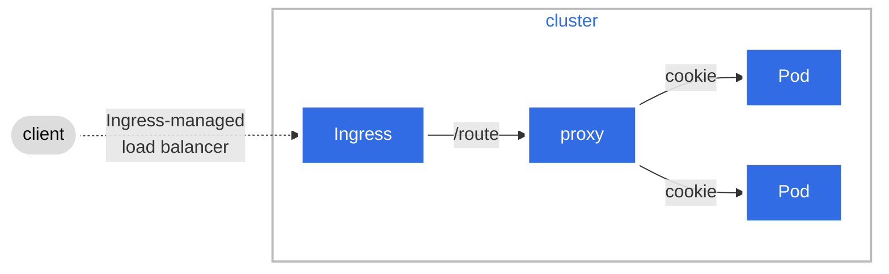

# pod-sticker

## Why Pod-Sticker?
The [12 factors methodology](https://12factor.net/) and most of modern cloud architecture best practices rely on application being stateless:
> Sticky sessions are a violation of twelve-factor and should never be used or relied upon.

That is a fair statement and I can understand the rational behind it but sometimes this is simply something we cannot change. Also stickyness and sessions can bring a lot of value in term of performance. How can we bring **stickyness** into a container based deployment such as kubernetes?

**pod-sticker** add `stickyness` to your **pods** by:
- keeping a list of active pods matching `POD_NAME_SELECTOR` by watching kubernetes events
- creating and keeping a list of **sessions** based on a cookie
- forwarding the requests to the pods 

:::info
A classic load balancer IP affinitiy cannot be used because most of the time our users will be coming from the same private network, hence will share the same IP.
:::

## Configuration

| Name | Description | Example value | 
| - | - | - |
| `POD_NAME_SELECTOR` | The criteria selection to forward the traffic | 'stateful-dpl' |
| `NAMESPACE` | The namespace containing the pods | 'default' |
| `COOKIE_NAME` | The cookie name that will ne positioned on the client | 'affinity-stateful' |
